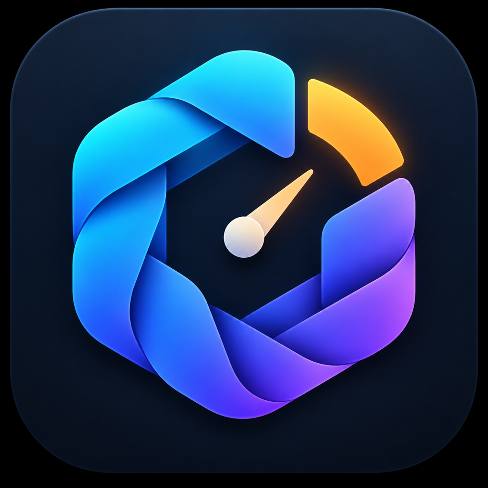
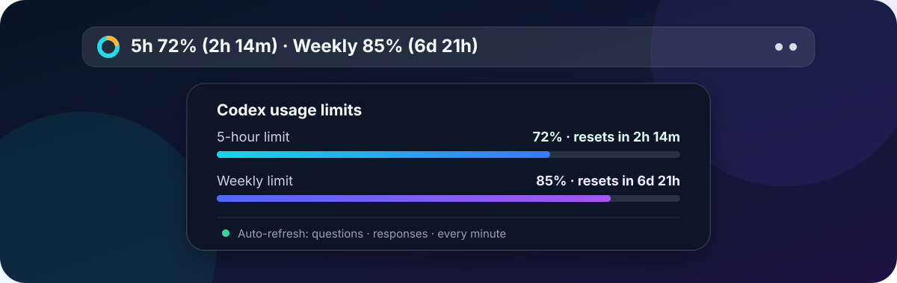

<div align="center">
  
  <h1>QuotaKnot</h1>
  <p><strong>Codex の利用枠を使い切る前に、ひと目で確認。</strong></p>
  <p>
    <a href="README.md">English</a> ·
    <a href="README.ko.md">한국어</a> ·
    <strong>日本語</strong> ·
    <a href="README.zh-CN.md">简体中文</a>
  </p>
  <p>
    <a href="https://github.com/edywoo/QuotaKnot/actions/workflows/build.yml"></a>
    
    
    <a href="LICENSE"></a>
  </p>
</div>

<p align="center">
  
</p>

QuotaKnot は、Codex の5時間・週間利用枠の残量と、それぞれのリセットまでの時間を表示する非公式の macOS メニューバーアプリです。

> QuotaKnot は OpenAI の公式製品ではなく、OpenAI との提携や推奨を受けたものではありません。

## 主な機能

- 5時間・週間利用枠の残量とリセットまでの時間をメニューバーに表示します。
- 24時間未満は `6時間23分`、24時間以上は `1日5時間` のように表示します。
- 質問の送信時と応答の完了時に自動更新します。
- 使用量は1分ごと、残り時間の表示は30秒ごとに更新します。
- 画面、時間単位、状態表示、エラーメッセージを英語・韓国語・日本語・簡体字中国語に切り替えられます。
- 別の API キーは不要で、インストール済みの Codex デスクトップアプリまたは CLI のログイン情報を使用します。
- モデルを呼び出さずに `account/rateLimits/read` メタデータを読むため、更新によって Codex トークンを消費しません。
- Apple Silicon と Intel Mac の両方に対応するユニバーサルアプリとしてビルドされます。

## 動作要件

- macOS 13 Ventura 以降
- Codex または ChatGPT デスクトップアプリ、もしくは Codex CLI
- ChatGPT アカウントで Codex にログイン済みであること
- ソースからビルドする場合は Swift 5.10 以降

## ソースからインストール

```zsh
git clone https://github.com/edywoo/QuotaKnot.git
cd QuotaKnot
./build-app.sh
./install-app.sh
```

アプリは `~/Applications/QuotaKnot.app` にインストールされます。終了するには、メニューバーの使用量表示を選択して **終了** をクリックしてください。

GitHub のビルドは Apple Developer ID による署名と公証がないため、macOS が初回起動をブロックする場合があります。その場合は Finder でアプリを Control キーを押しながらクリックし、**開く** を選択するか、ソースから直接ビルドしてください。

## Codex の自動検出

QuotaKnot は次の場所を自動的に確認します。

- `/Applications` と `~/Applications` 内の Codex または ChatGPT アプリ
- Apple Silicon または Intel Mac の Homebrew でインストールされた Codex
- `PATH`、`~/.local/bin`、`~/.cargo/bin`、`~/.npm-global/bin`

独自の場所にインストールしている場合は、パスを指定して起動できます。

```zsh
CODEX_CLI_PATH=/custom/path/codex CODEX_HOME=/custom/codex-home \
  "$HOME/Applications/QuotaKnot.app/Contents/MacOS/QuotaKnot"
```

## 検証と配布用ファイルの作成

```zsh
swift run QuotaKnotCoreChecks
./package-release.sh
```

GitHub Actions は push と pull request ごとに動作チェックを実行し、ユニバーサル macOS ZIP artifact を作成します。

## プライバシーと通信

- ソースには個人名、メールアドレス、固定されたユーザーホームパスを含みません。
- 別の API キーを要求したり保存したりしません。
- インストール済み Codex の `account/rateLimits/read` を呼び出し、質問や応答は送信しません。
- イベントによる自動更新では、ローカルセッションファイルに新しく追加された行だけを読み、`task_started` と `task_complete` のイベント名だけを判別します。
- 最新の使用率とリセット時刻だけを macOS の `UserDefaults` にキャッシュします。
- 分析ツール、広告 SDK、外部トラッキングサーバーは使用しません。

## 既知の制限

使用量の取得は、現在 Codex の実験的な app-server プロトコルに依存しています。インストール済みの Codex が対象メソッドを提供しない場合や、今後プロトコルが変更された場合は取得に失敗する可能性があります。

## ライセンス

[MIT License](LICENSE) の下で公開されています。

`Codex` と `OpenAI` の名称は、対応サービスとの互換性を説明する目的でのみ使用しています。
